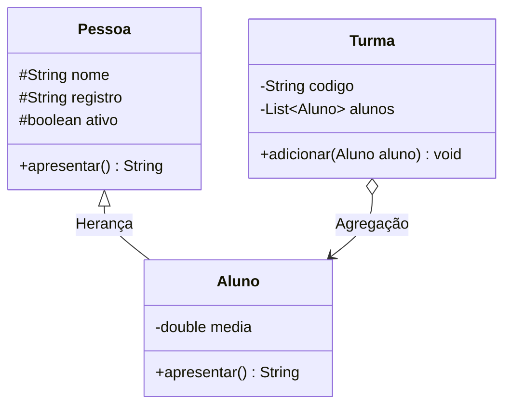

Este é o diagrama de classe inicial

```mermaid
classDiagram
direction TB
    class Pessoa {
	    #String nome
	    #String registro
	    #boolean ativo
	   
	    +apresentar() String
    }

    class Aluno {
	    -double media
	   
	    +apresentar() String
    }

    class Turma {
	    -String codigo
	    -List~Aluno~ alunos
	    +adicionar(Aluno aluno) void
    }

    Pessoa <|-- Aluno : Herança
    Turma o--> Aluno : Agregação
```